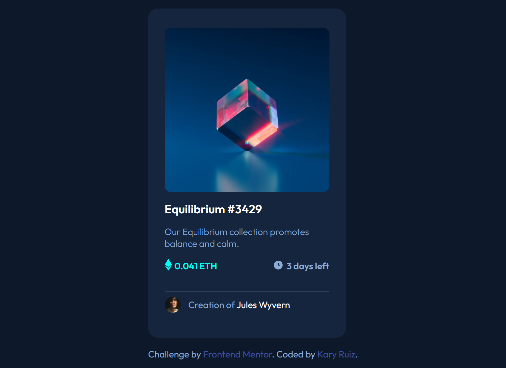

# Frontend Mentor - NFT preview card component solution

This is a solution to the [NFT preview card component challenge on Frontend Mentor](https://www.frontendmentor.io/challenges/nft-preview-card-component-SbdUL_w0U). Frontend Mentor challenges help you improve your coding skills by building realistic projects. 

## Table of contents

- [Overview](#overview)
  - [The challenge](#the-challenge)
  - [Screenshot](#screenshot)
  - [Links](#links)
- [My process](#my-process)
  - [Built with](#built-with)
  - [What I learned](#what-i-learned)
  - [Continued development](#continued-development)
  - [Useful resources](#useful-resources)

## Overview

### The challenge

Users should be able to:

- View the optimal layout depending on their device's screen size
- See hover states for interactive elements

### Screenshot



### Links

- Solution URL: [Solution URL here](https://your-solution-url.com)
- Live Site URL: [Github Page URL here](https://your-live-site-url.com)

## My process

### Built with

- Semantic HTML5 markup
- CSS custom properties
- Flexbox
- CSS Grid
- Mobile-first workflow

### What I learned

This challenge helped me strengthen my knowledge and find new solutions.

The property that helped me solve the interaction challenge is `opacity`.

The `opacity` property is often used together with the `:hover` selector to change the opacity on mouse-over:

```css
img {
  opacity: 0.5;
}

img:hover {
  opacity: 1.0;
}
```

### Continued development

After this challenge, I think I have to practice some interactive effects.

### Useful resources

- [Opacity](https://www.w3schools.com/css/css_image_transparency.asp) - The opacity property specifies the opacity/transparency of an element.